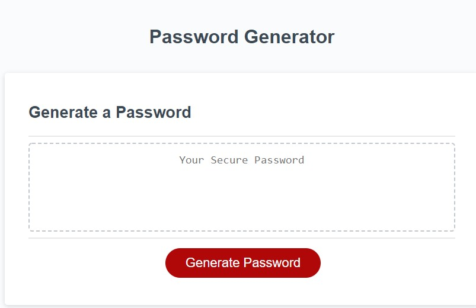
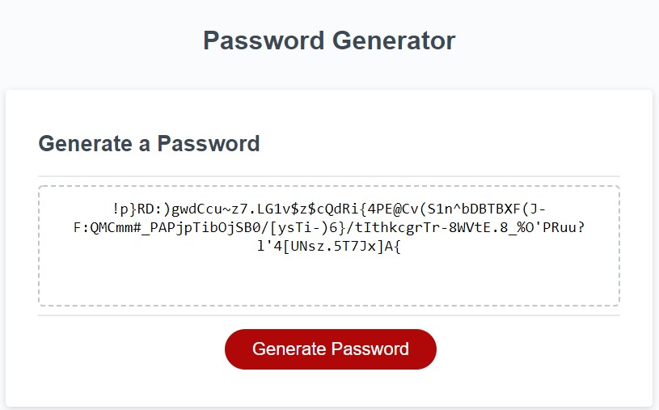

# PasscodeGenerator
Week 3 Homework

**how it works**

When the Generate Password is clicked, then prompts will ask the user various requirements for the password.

Utilizing the user responses, the code will add characters into the array, and a random number generator will generate a number

the number will be used to index the array, and pull the corresponding character out of the large array. 

this is done consecutively in a loop, until the amount of characters are generated for the user's required length. 
when complete, the password will be given in the read only text area. 

